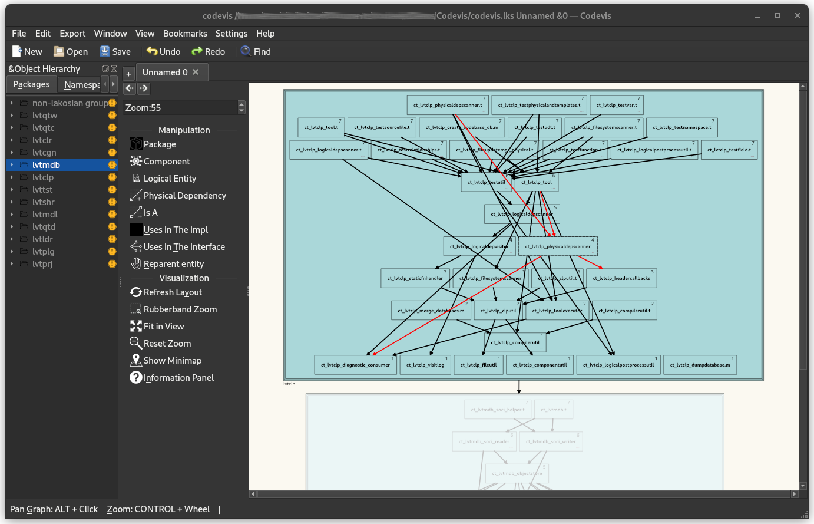

# Codevis

## Prebuilt binaries

- [**Windows (.exe)**](https://invent.kde.org/sdk/codevis/-/jobs/1392579/artifacts/raw/.kde-ci-packages/codevis-master-420-windows-cl-msvc2019-x86_64.exe)
- [**Ubuntu 22.04 (.tar.gz)**](https://invent.kde.org/sdk/codevis/-/wikis/uploads/3d638af46b04db490f31871717e303c6/codevis-ubuntu-22.04.tar.gz)

Codevis is an analysis and visualization tool designed to assist in code maintenance for C++ codebases.

The tool provides a graph representation of C++ source code and its external dependencies.
It is aimed at developers working primarily with large codebases, who would benefit from being able to visualise
source code in order to effectively understand it and its dependencies, for debugging their code or reviewing others' work.

This tool was developed by Codethink as part of a project sponsored by Bloomberg.
The tool is based on John Lakos' ideas, which can be found in his books ("[Large Scale C++ Software Design](https://www.amazon.com/Large-Scale-Software-Design-John-Lakos/dp/0201633620/)"
and "[Large Scale C++ Volume 1: Process and Architecture](https://www.amazon.com/Large-Scale-Architecture-Addison-Wesley-Professional-Computing/dp/0201717069/)"),
as a means of displaying logical and physical entities.

## Menu

- [Quick Start](#quick-start)
- [Building](#building)
- [Contributions](#contributions)
- [License](#license)
- [Code of Conduct](#code-of-conduct)
- [Security Vulnerability Reporting](#security-vulnerability-reporting)

## Quick Start

See [Getting started](doc/getting_started.md) for information about using the tool.
There's also [CLI documentation](doc/command_line_codebase_generation.md).

## Building

To build the tool, follow the documentation for your operating system: 

- [Linux](doc/build_linux.md)
- [Windows](doc/build_windows.md)
- [MacOS](doc/build_macos.md)

## Contributions

We :heart: contributions.

Have you had a good experience with this project? Why not share some love and contribute code, or just let us know about any issues you had with it?

We welcome issues reports. Just be sure to choose the proper issue template for your issue, so that we can be sure you're providing us with the necessary information.

Before sending a Pull Request, please make sure you read our [Contribution Guidelines](CONTRIBUTING.md).

## License

Please read the [LICENSE](LICENSE).

## Code of Conduct

This project has adopted a [Code of Conduct](CODE_OF_CONDUCT.md).

## Security Vulnerability Reporting

Please refer to the project [Security Policy](SECURITY.md).
