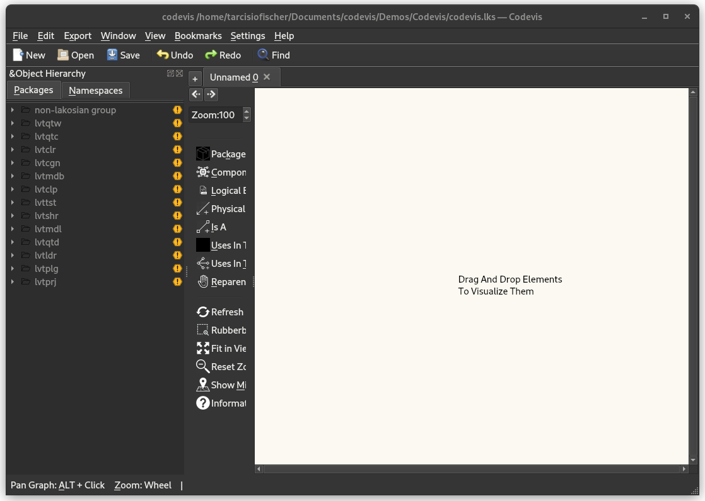

# Getting Started

This documentation the GUI application. For the command line tools see the [CLI documentation](command_line_codebase_generation.md).

- [Visualizing code](#visualizing-code)
- [Generating a database using the GUI](#generating-a-database-using-the-gui)

## Visualizing code

Before going into details on how to visualize your own code, consider the [pre-parsed project files in our repository](../examples/).
Codevis GUI doesn't visualize source code directly, it visualizes project files (.lks files) previously parsed using
our parsing libraries. This can be done either using the CLI or the GUI.

For a first approach, consider the example project [codevis.lks](../examples/codevis.lks). To visualize the code, first [download and install codevis](../README.md#prebuilt-binaries), then open the GUI and select "Open existing project". Finally, select the `codevis.lks` inside the example folder.



The left panel shows the available packages for this project. Depending on how your project has been parsed, it may be
the case that your packages end up in the `non-lakosian group`, so you may want to expand that group to search for it.
you can also `ctrl-f` for specific packages or components to filter the tree.

Select `lvtldr` in the tree and drag-and-drop it to the scene. Right click on the `lvtldr` package in the scene and then
select "Load packages or Components" to visualize that particular package:


Codevis will try to show packages and components in a "levelized" way, as shown in the above figure. But if there are
dependency cycles in the code, it will heuristically try to accomodate components in a digestable way, if possible. In
the image above, there is a cycle between some of the components, but there's still a heuristically-defined hierarchy
between the components.

"Raw" codevis is only able to show your architecture as it is. In order to further inspect the codebase, the plugin system
must be used. There are [several plugins implemented](../plugins/), but users can develop their own. See the [Python Template Plugin](../plugins/python_template_plugin/) for
a quick example. For more information see the [Plugins documentation](plugins.md).


## Generating a database using the GUI

In order to parse your code, you need a [compile_commands.json](https://clang.llvm.org/docs/JSONCompilationDatabase.html) file. This file [can be easily generated by cmake](https://cmake.org/cmake/help/latest/variable/CMAKE_EXPORT_COMPILE_COMMANDS.html) adding
`-DCMAKE_EXPORT_COMPILE_COMMANDS=ON` when you run cmake. If you are not using cmake, consider using [Bear](https://github.com/rizsotto/Bear).

Open the GUI and navigate to "File/New Project From Source Code...". In the dialogue that
pops up, options can be set for the database generation. Give your project a name before the parsing dialog shows.


The suggested setting for the "ignore file matching glob pattern" is
```
*.t.cpp,*thirdparty*,*standalone*,*.m.cpp
```
but this is just a suggestion so that the resulting database don't consider those files.

The "Parse only physical relations" controls whether the tool will only look at
physical information or if it will also generate logical information. See the
[Physical vs Logical](#physical-vs-logical) section for more information.

Once you're ready, press "Parse" to begin database generation. There is a
progress bar to track what is happening. After the physical parse is done the
window can be closed using the "Hide" button. If a logical parse was also
requested, this will continue in the background even after the window is closed
and the database will be updated with logical information once it becomes ready.


### Physical vs Logical

As discussed in "Large-Scale C++ Volume 1" by John Lakos, the physical design of
software relates to how files are laid out on disk and how they are compiled
and linked into a unit of release. The logical design of software relates to
the layout of the software within the semantics of the programming language.

For example, physical things include
- Components
- Packages
- Package groups
- Physical dependency (`#include` relationships between components) relationships

Logical things include
- Types
- Namespaces
- Uses-In-The- relationships
- Is-A relationships

Creating a database storing only the physical layout of software is relatively
fast because only the layout of files on disk and their `#include`s need to be
processed. A "physical-only" parse is recommended if you are only interested in
this information.

Viewing logical information requires a logical parse (done after a physical
parse). This takes much longer because a full AST has to be generated and type
checked and more information has to be stored about each file.


### Codevis relational database schema

Codevis processes your source code and generates a relational database representation of it.
The relational database schema is [available here](../database-spec/), but a representation of
it is also available below. Codevis has several internal libraries to interact with the database,
the most important being [lvtmdb](../lvtmdb/).


